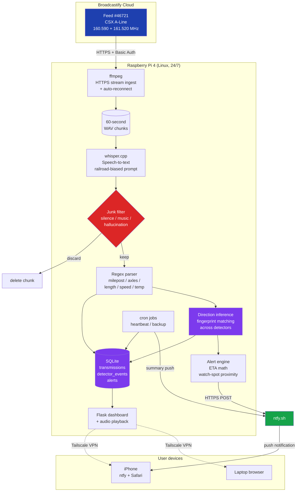

# 🚂 Trainwatch

**Real-time railroad radio intelligence on a Raspberry Pi.**

Trainwatch is a 24/7 pipeline that ingests live freight railroad radio traffic, transcribes it with OpenAI's Whisper, parses defect detector announcements into structured data, and pushes mobile notifications when a train is approaching a designated watch location.

Built so I can take my son to watch trains roll through Ettrick, VA when freight is actually coming.

---

## What it captures

After ~24 hours of running on a single Broadcastify-sourced audio feed:

| | |
|---|---|
| **Transmissions** | 1,335 |
| **Detector events** | 220 |
| **Last 24h** | 248 |

Each transmission stores the original audio, a Whisper-generated transcript, and parsed metadata where applicable (milepost, axle count, train length, speed, temperature, defect flag).

---

## Architecture



### How the pipeline works

A Broadcastify Premium audio stream pipes live railroad scanner audio over HTTPS. ffmpeg authenticates, ingests the MP3, and segments it into 60-second WAV chunks. Each chunk is transcribed by whisper.cpp with a domain-specific prompt biasing recognition toward railroad terminology (mileposts, axle counts, defect calls, train length).

A junk filter inspects each transcript and deletes chunks containing only silence, music, ads, or Whisper hallucinations like repeated "you" tokens on near-silent audio. Useful chunks are archived; their transcripts are written to SQLite.

A regex-based parser scans each transcript for defect detector announcements. It handles the messy reality of real-world ASR output: mangled decimal mileposts ("milepost 4, 6.8" → 46.8), apostrophe-confused possessives ("total axle's 268"), and decimal-confused integers ("axle 6.2" → 62). Plausibility checks reject implausible values; a "snap to known detector" step matches noisy mileposts against the known set {3.0, 17.4, 33.7, 46.8, 58.2}.

When a detector event is logged, direction inference runs: if the same train (matched by axle count and length fingerprint) hit a different detector within the last 90 minutes, direction and ground speed are computed from the milepost and time deltas. If the train is heading toward a designated watch spot within an 8–60 minute window, an alert fires via ntfy.sh push notifications.

The Flask dashboard serves a live view of recent transmissions with inline audio playback, accessible from anywhere via Tailscale VPN. Daily cron jobs push a heartbeat summary at 8 AM and snapshot the SQLite database at 3:30 AM with 30-day retention.

The pipeline runs as two systemd services (capture + web), both auto-restarting on failure and surviving reboots.

---

## Dashboard

The Flask dashboard surfaces real-time statistics, the most recent transmissions with inline audio playback, and recent alerts.


The "All transmissions" view shows every logged transmission with audio playback inline. Detector events are highlighted with a blue accent and ⚙ flag.


---

## Tradeoffs and engineering decisions

### Why Broadcastify instead of a local antenna

The original architecture used an RTL-SDR Blog V3 dongle and an indoor dipole antenna to receive railroad radio directly. Through systematic diagnosis — including a controlled signal-strength comparison against the 1000-watt NOAA weather radio transmitter in Richmond — I identified that VHF reception at 1-5 watts (which is what defect detectors transmit) was the limiting factor, not the software pipeline. The dipole could pull a kilowatt signal from 25 miles cleanly, but couldn't reliably catch 1-5 watt detector announcements from 6 miles because of indoor obstructions and interference.

Rather than invest in outdoor antenna hardware (mast, low-loss coax, weatherproofing), I pivoted to ingest a Broadcastify Premium feed maintained by an operator in Stony Creek, VA — ~25 miles south of my watch location, with a properly mounted outdoor antenna near the tracks. This separated signal acquisition from data pipeline concerns, let the system start producing real value immediately, and reframed the dongle as future hardware for a separate ADS-B aircraft tracking project. The tradeoff is a $15/month subscription and a dependency on a third-party feed staying online.

### Why 60-second fixed chunks instead of voice-activity-triggered segments

The local-radio version used sox's silence-detection to emit one WAV per transmission. The Broadcastify version uses fixed 60-second chunks because defect detector announcements take 30-60 seconds to deliver, and the upstream feed already had its own silence handling. Variable-length segmentation here would risk slicing announcements in half. Fixed chunks guarantee full announcements stay intact through Whisper, at the cost of slightly higher transcription overhead.

### Why snap mileposts to a known set instead of trusting Whisper's output

Real-world testing showed Whisper transcribes "milepost forty six point eight" inconsistently — sometimes as "46.8", sometimes "4, 6.8", sometimes "4 6 point 8". A naive parser would log phantom detectors at milepost 4, 6, or 46. Snapping the parsed value to the nearest known detector within a 1.5-mile tolerance produces high-confidence locations even on degraded transcripts.

### Why wait for thousands of events before building ML

Tempting to add a prediction model immediately. But at ~30 detector events per day, statistically meaningful patterns (hour-of-day, day-of-week, train-symbol clustering) need ~500-2000 events. Building ML on early data would overfit to noise. The schema is designed to support a future prediction layer; the model itself waits until the distribution is real.

---

## Stack

- **Audio ingestion:** ffmpeg, Broadcastify Premium feed
- **Speech-to-text:** whisper.cpp (base.en model)
- **Parsing:** Python, regex
- **Storage:** SQLite
- **Dashboard:** Flask + HTML5 audio
- **Notifications:** ntfy.sh
- **Remote access:** Tailscale VPN
- **Services:** systemd (auto-restart, survives reboot)
- **Maintenance:** cron (daily heartbeat + DB backup with 30-day retention)
- **Hardware:** Raspberry Pi 4

---

## Repository layout

```
trainwatch/
├── scripts/
│   ├── capture_stream.py    # Broadcastify ingestion + transcription pipeline
│   ├── transcribe.py        # whisper.cpp wrapper with railroad prompt
│   ├── parser.py            # Defect detector regex parser with milepost snapping
│   ├── alerts.py            # ETA math + ntfy push
│   ├── direction.py         # Direction inference via axle/length fingerprint matching
│   ├── heartbeat.py         # Daily summary ntfy
│   ├── backup_db.py         # Daily SQLite snapshot with auto-pruning
│   ├── init_db.py           # Schema initialization
│   ├── config.py            # Configuration (placeholders; real values via config_local.py)
│   └── ...
├── web/
│   └── app.py               # Flask dashboard
├── config/
│   └── broadcastify.ini.example   # Template; real credentials gitignored
├── LICENSE
└── README.md
```

---

## Setup

```bash
# Clone
git clone https://github.com/leoagenders/trainwatch.git
cd trainwatch

# Virtual environment
python3 -m venv venv
source venv/bin/activate
pip install flask requests

# whisper.cpp (build locally; see https://github.com/ggerganov/whisper.cpp)
# Place the binary and base.en model where transcribe.py expects them

# Credentials
cp config/broadcastify.ini.example config/broadcastify.ini
chmod 600 config/broadcastify.ini
# Edit with your Broadcastify username, password, feed URL

# Local overrides (real coordinates, ntfy topic) — not committed
cat > scripts/config_local.py <<EOF
NTFY_TOPIC = "your-private-topic"
HOME_LATITUDE = 0.0
HOME_LONGITUDE = 0.0
EOF

# Initialize database
python scripts/init_db.py
python scripts/seed_data.py  # Seeds known detectors and watch spots

# Run
python scripts/capture_stream.py    # Capture pipeline
python web/app.py                   # Dashboard on :5000
```

For 24/7 operation, install the systemd unit files (not committed for brevity; see Trainwatch wiki for templates).

---

## Roadmap

- [ ] Hourly distribution model once ~500 detector events accumulated
- [ ] Day-of-week pattern analysis at ~2000 events
- [ ] Train-symbol clustering via axle/length/timing fingerprints
- [ ] Heatmap dashboard view (7-day × 24-hour grid)
- [ ] Anomaly detection for unusual activity windows
- [ ] Confidence-weighted predictions with feedback loop (saw/missed/dismissed buttons already wired)

---

## Legal and ethical notes

Trainwatch is a personal hobbyist monitoring project. A few notes on the responsibility side:

- All radio reception is of unencrypted public-band signals freely receivable under FCC rules and the Electronic Communications Privacy Act.
- Audio source is a personally-licensed Broadcastify Premium feed; redistribution of the source audio is not permitted by their ToS, and Trainwatch does not redistribute it.
- Captured audio and transcripts are stored locally on the Pi only. The dashboard is reachable only via Tailscale VPN — it is not exposed to the public internet.
- The project does not transmit on any railroad frequency and the RTL-SDR hardware is receive-only by design.
- No employee names, identifying voices, or identifiable individual transmissions are made public in this repository.

This is a backyard data project so I can watch trains with my kid. It's not a surveillance tool, not a commercial product, and not a service offered to others.

---

## License

MIT. See [LICENSE](LICENSE).

---

Built by Leo, 2026. If you're building something similar and want to compare notes, the issues tab is open.
